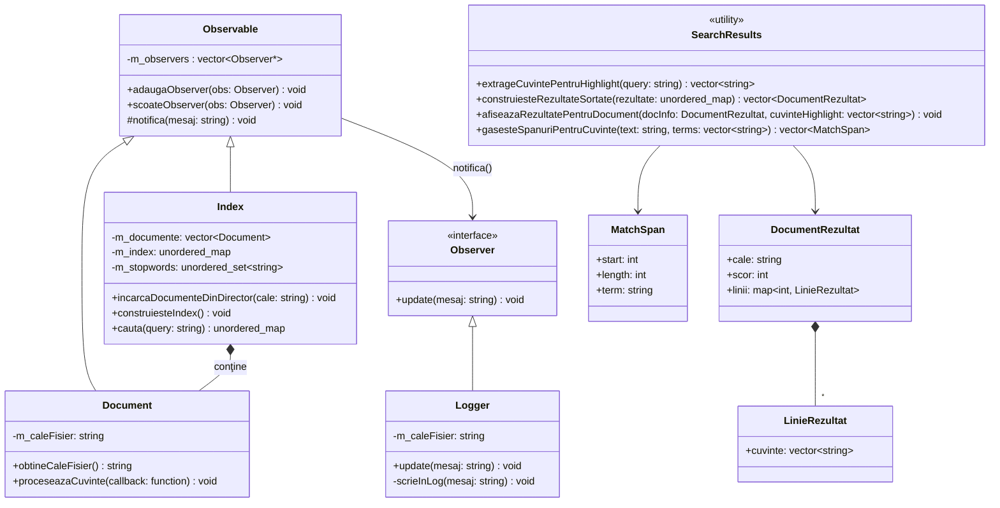

# Documentație Proiect POO - Motor de Căutare

## 1. Descrierea Proiectului
Acest proiect implementează un motor de căutare local, oferind capabilități de indexare text și interogare rapidă, folosind concepte de Programare Orientată pe Obiecte în C++. Sistemul scanează fișiere dintr-un director, extrage cuvinte (fără stopwords) și creează un Inverted Index pentru a permite utilizatorului să găsească exact fișierele și rândurile pe care apare o anumită interogare. Include atât o versiune CLI, cât și una GUI (bazată pe Dear ImGui).

## 2. Concepte POO Folosite

*   **Clase și Obiecte:** Funcționalitatea este divizată în clasele `Index` (gestionează memoria, algoritmii de parsare și căutarea), `Document` (încapsulează informațiile unui fișier specific) și `Logger` / `Observable`.
*   **Encapsulare:** Atributele critice (ex. `m_documente`, `m_index`, `m_stopwords`) sunt protejate sub eticheta `private` și nu pot fi modificate accidental. Variabilele expuse sunt modificate și accesate doar prin structuri de getter/setter sau prin metode dedicate de căutare (`cauta`, `incarcaDocumenteDinDirector`).
*   **Moștenire și Polimorfism (Design Pattern-ul Observer):**
    Aplicația folosește un sistem Observer. Clasa virtuală pură `Observer` forțează subclasele să implementeze metoda de actualizare. `Logger`-ul extinde public obsever-ul (`class Logger : public Observer`) și se înscrie la `Observable`-ul de bază pentru a înregistra evenimentele de căutare.
*   **Șabloane de Proiectare și Componente STL:** Utilizare extensivă a standard template library, cu predilecție către elemente optime de hashing - `std::unordered_map`, `std::unordered_set` (cost `O(1)`), iteratori (`std::vector`), abstracții funcționale Lambda (`std::function`).

## 3. Optimizări Majore de Memorie și Structuri
Aplicația a fost eventual modificată pentru a reduce memoria ocupată pentru fișiere mari:
1.  **Block-Reading vs File Slurping:** S-au eliminat citirile ineficiente stocate pe heap printr-un design arhitectural care folosește callback funcțional (`std::function` și Lambda Expression). `Document::proceseazaCuvinte` parsează text în chunk-uri de `64 KB`. 
2.  **Optimizări Hash-Table vs Arbori Binari:** Indexul în sine a fost modificat de la `std::map<string, map<...>>` cu `O(log n)`, la `std::unordered_map<std::string, std::vector<std::pair<size_t, std::vector<int>>>>` cu `O(1)`. 
3.  **Reducerea redunanței structurilor:** Paginile indexului evită stocarea `string`-urilor complete de zeci de mii de ori făcând maparea folosind direct indentificatori numerici (integers `size_t`) care corespund memoriei globale din manager-ul de bază `Document`.

Aceste optimizări au redus memoria consumată pentru indexarea unui .txt de 1GB pe o linie de la ~5GB la 64KB, și multiline la ~800MB.

## 4. Caracteristici de Căutare

### 4.1. Căutare Standard și Phrase Search
- **Căutare standard:** Interogări separate prin spații sunt combinate cu semantica AND (implicit). Cuvintele în `stopwords.txt` sunt ignorate automat.
- **Phrase Search:** Termeni închiși în ghilimele (ex: `"exact phrase"`) sunt tratați ca o frază exactă și se caută pe aceeași linie, într-o ordine și poziție specifice.
- **Excludere fișiere sistem:** Fișierele `log.txt` și `stopwords.txt` sunt excluse din indexare pentru a evita rezultate înșelătoare.

### 4.2. Highlighting și Afișare Rezultate
- **Inline Highlighting (GUI):** Textul din rezultate afișează termenii potriviți în galben, cu wrapping automat la limita ferestrei.
- **CLI Highlighting:** Termenii sunt evidențiați cu coduri ANSI în ieșirea consolei.
- **Span-uri de Potrivire:** Funcția `gasesteSpanuriPentruCuvinte` calculează pozițiile (byte offset-uri) pentru fiecare termen potrivit, evitând suprapuneri și verificând granițe de cuvânt.

## 5. Utilități și Componente de Rezultate

### 5.1. SearchResults
Modulul `SearchResults` furnizează funcții helper pentru construirea și afișarea rezultatelor de căutare:

- **`extrageCuvintePentruHighlight(query: string) → vector<string>`**  
  Extrage din interogare termenii de highlighting (ignora operatori booleeni și ghilimele).

- **`construiesteRezultateSortate(rezultate) → vector<DocumentRezultat>`**  
  Transformă indexul invers (unordered_map) într-un vector de rezultate sortat descendent după scor.

- **`gasesteSpanuriPentruCuvinte(text, terms) → vector<MatchSpan>`**  
  Returnează o listă de span-uri ne-supravompuse (offset-uri în bytes) pentru termenii furnizați, cu verificare de granițe de cuvânt (UTF-8 aware).

- **`afiseazaRezultatePentruDocument(docInfo, cuvinteHighlight)`**  
  Afișează în consolă (CLI) liniile potrivite cu highlighting în culori ANSI.

### 5.2. Structuri de Rezultate

- **`LinieRezultat`:** Conține vectorul de cuvinte potrivite pe o linie specifică.
- **`DocumentRezultat`:** Încapsulează calea fișierului, scorul (numărul de potriviri) și o hartă de linii cu termenii lor potriviți.
- **`MatchSpan`:** Definește o potrivire: `start` (offset), `length` (lungimea în bytes), `term` (termenul potrivit).

## 6. Interfața GUI

### 6.1. Highlighting și Wrapping
- GUI-ul afișează textul liniilor potrivite cu termenii evidențiați inline în galben.
- Textul se rupe pe randuri atunci când depășește lățimea ferestrei disponibile, păstrând colori și indentarea.

### 6.2. Gestionarea Fonturilor
GUI-ul încearcă să înccarce un font TTF cu suport pentru caractere diactrice românești (gliph-uri din intervalul Latin Extended A+B):

1. **Font din proiect:** `vendor/imgui/misc/fonts/DroidSans.ttf` sau `Roboto-Medium.ttf`
2. **Font de sistem:** `/usr/share/fonts/truetype/dejavu/DejaVuSans.ttf` (Linux)
3. **Fallback:** Dacă niciun font nu e disponibil, ImGui utilizează fontul implicit (s-ar putea pierde diacritice).

Această abordare asigură portabilitate și nu depinde de configurații fixe ale sistemului.

## 7. Testare și Integrare Continuă
Proiectul include teste unitare simple în `tests/test_index.cpp`, compilate ca executabil separat prin CMake și rulate automat cu `ctest`.

Pentru integrarea pe GitHub, repository-ul conține workflow-ul `.github/workflows/tests.yml`, care execută următorii pași la `push` și `pull_request`:
* checkout pentru cod și submodule
* instalarea dependențelor de build
* configurarea și construirea proiectului cu CMake
* rularea testelor prin `ctest --output-on-failure`

Această integrare permite verificarea automată a proiectului înainte de acceptarea modificărilor și ajută la menținerea unei baze de cod stabile.

## 8. Diagrama UML (Simplificată)
